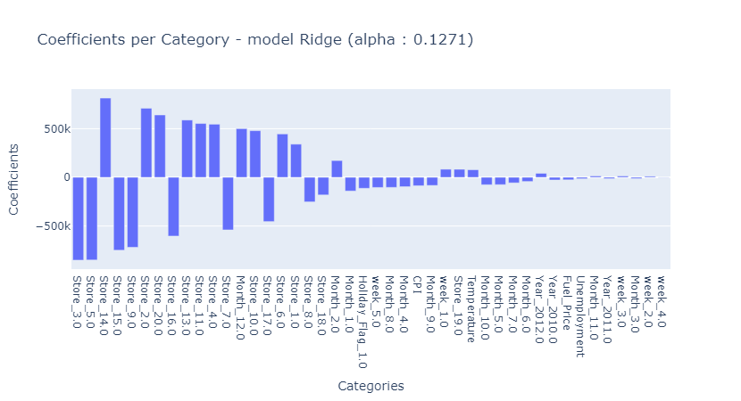

# supervised-machine-learning--walmart-sales

Project completed as part of my Data Science Fullstack training at Jedha (Paris)

# Walmart : predict weekly sales
## Company's Description 📇

Walmart Inc. is an American multinational retail corporation that operates a chain of hypermarkets, discount department stores, and grocery stores from the United States, headquartered in Bentonville, Arkansas. The company was founded by Sam Walton in 1962.

## Project 🚧

Walmart's marketing service has asked you to build a machine learning model able to estimate the weekly sales in their stores, with the best precision possible on the predictions made. Such a model would help them understand better how the sales are influenced by economic indicators, and might be used to plan future marketing campaigns.

## Goals 🎯

The project can be divided into three steps:

- Part 1 : make an EDA and all the necessary preprocessings to prepare data for machine learning
- Part 2 : train a **linear regression model** (baseline)
- Part 3 : avoid overfitting by training a **regularized regression model**

## Scope of this project 🖼️

For this project, you'll work with a dataset that contains information about weekly sales achieved by different Walmart stores, and other variables such as the unemployment rate or the fuel price, that might be useful for predicting the amount of sales. 

## Deliverable 📬

To complete this project, you should: 

- Create some visualizations
- Train at least one **linear regression model** on the dataset, that predicts the amount of weekly sales as a function of the other variables
- Assess the performances of the model by using a metric that is relevant for regression problems
- Interpret the coefficients of the model to identify what features are important for the prediction
- Train at least one model with **regularization (Lasso or Ridge)** to reduce overfitting

# My results :

   Models               | R2 Score Train | R2 Score Test | RMSE Train   | RMSE Test    |
 |----------------------|----------------|---------------|--------------|--------------|
 | Baseline-LR          | 0.991767	     | 0.937586	     | 62813.054981 | 145562.580280|
 | Ridge (alpha: 0.1271)| 0.990520	     | 0.942983	     | 67401.647594	| 139126.592890|
 | Lasso (alpha: 6.355) | 0.991767	     | 0.937675	     | 62813.534904	| 145459.096655|

 
